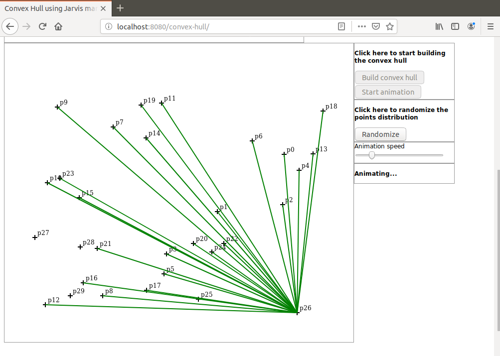
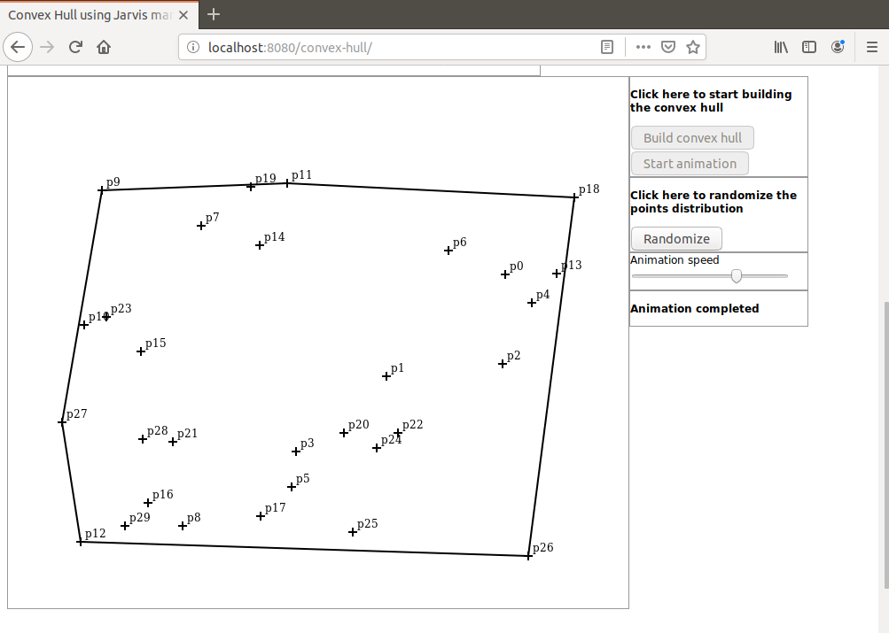

# jarvis-anim
Java based animated demonstration of the Graham Jarvis March algorithm applied to build the convex hull of a points distribution

I present here a Java based animated demonstration of the Jarvis March algorithm that is used to find the convex hull of a random points distribution.

Javascript is used for display and initialization only. Here are the implementation details:

A random points distribution is created (browser side)

The distribution is sent to the server as a JSON object.

Then the Jarvis March is executed (server side).

All intermediate results are saved as a collection that is sent to the browser as a JSON object.

The collection is used for animation (browser side). 

All candidates are connected in green to the current vertex. The convex hull itself is drawn in black.

This implementation does not use any explicit angle. No trigonometric functions are used. Instead a cross product is used for all angle comparisons.

To launch the demo run the command `mvn springboot:run` in project directory. When the application has started open a browser and hit URL `localhost:8080/convex-hull`.

Here are some screen shots that can be seen during the demo:

Animation step

Animation completed

For a step-by-step demonstration of the Jarvis March algorithm please visit these repository:

https://github.com/dubersfeld/jarvis-step

For a demonstration of the Graham Scan algorithm please visit these repositories:

https://github.com/dubersfeld/graham-step

https://github.com/dubersfeld/graham-anim

For a video demo follow this link:

https://youtu.be/FUdqo1eXt3c

Dominique Ubersfeld, Cachan, France
